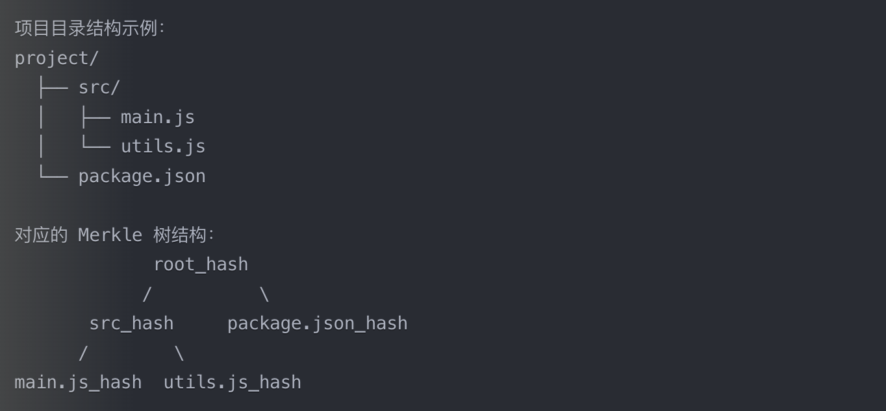

# Cursor 代码库索引系统介绍

Cursor 作为一款现代化的代码编辑器，其最强大的特性之一是语义化代码索引能力。这项技术让 AI 能够理解整个代码库的上下文，从而提供更准确的代码建议和问题解答。本文将详细介绍这个系统的工作原理。

## 0. 参考文档

Cursor的代码索引机制介绍，来自官方文档[Codebase Indexing](https://www.cursor.com/security#indexing)。

## 1. 系统概述

在介绍具体细节之前，让我们先了解 Cursor 代码索引系统的基本工作方式。该系统默认开启，会自动扫描并索引您的代码库，同时通过精心设计的安全机制保护代码隐私。

### 1.1 基本特性

- **默认启用**：安装后即可使用，无需额外配置
- **可配置性**：支持在初始设置或后续使用中调整
- **灵活控制**：通过 `.gitignore` 和 `.cursorignore` 精确控制索引范围

### 1.2 工作流程

系统采用以下步骤处理代码：

1. 本地扫描并构建 Merkle 树
2. 仅同步发生变更的文件
3. 服务端进行向量化处理
4. 存储加密后的索引信息

## 2. 技术架构

Cursor 的索引系统采用了分布式架构，将处理任务合理分配在客户端和服务器端。

### 2.1 客户端处理

客户端主要负责：

- **文件监控**：每 10 分钟进行一次变更检测
- **Merkle 树构建**：用于高效识别文件变化
- **增量同步**：仅上传变更部分，节省带宽
- **本地缓存**：维护必要的元数据

### 2.2 服务器端处理

服务器端的主要职责包括：

- **文件分块**：将代码切分为语义完整的片段
- **向量嵌入**：生成代码的语义表示
- **存储管理**：通过 Turbopuffer 实现高效存储和检索
- **缓存优化**：利用 AWS 提供快速的二次索引能力

## 3. 安全机制

安全性是 Cursor 代码索引系统的核心考虑之一，采用了多层次的保护措施。

### 3.1 文件路径保护

为了保护代码库的结构信息：

- 使用确定性加密处理文件路径
- 保留基本层级结构以确保可用性
- 采用 6 字节随机数增加安全性

### 3.2 向量存储安全

在向量存储方面：

- 仅存储混淆后的文件路径
- 记录代码块行号范围
- 实现文件路径过滤功能

### 3.3 Git 历史保护

对于 Git 仓库：

- 存储提交 SHA 和父节点信息
- 使用特殊的文件名混淆机制
- 基于提交内容派生加密密钥

## 4. 实现限制

当前系统存在一些技术限制：

### 4.1 索引限制

- 高负载情况下可能出现请求失败
- 部分文件可能需要多次上传
- 带宽使用可能超出预期

### 4.2 安全考虑

- 向量嵌入可能存在理论上的逆向风险
- 目录结构信息可能部分泄露
- 随机数碰撞的可能性

## 5. 最佳实践

为了充分利用 Cursor 的代码索引能力，建议：

### 5.1 配置建议

- 合理使用 `.cursorignore` 排除敏感文件
- 定期检查索引状态
- 根据团队需求调整安全设置

### 5.2 性能优化

- 适当控制代码库大小
- 合理组织代码结构
- 避免频繁大规模变更

## 结语

Cursor 的代码索引系统通过巧妙的技术设计，在保证性能的同时维护了代码的隐私和安全。这一系统使 AI 辅助编码能够更好地理解开发者的意图，提供更准确的帮助。随着技术的不断发展，我们期待看到这一系统在未来带来更多可能性。